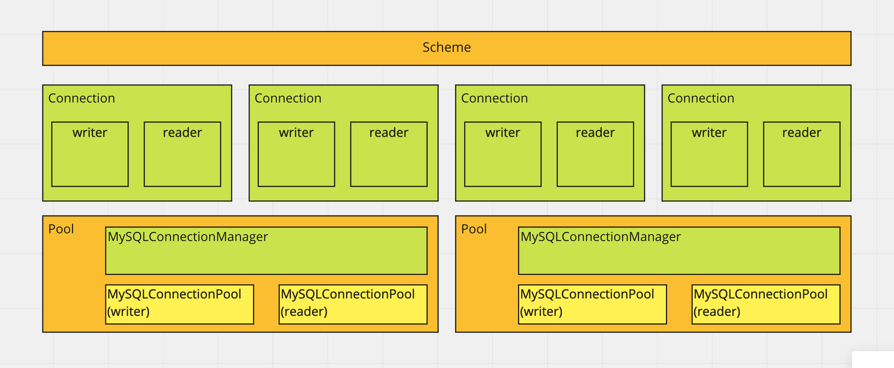

# ReadME

[](https://app.codacy.com/gh/TaxiGo-tw/pool-mysql?utm_source=github.com&utm_medium=referral&utm_content=TaxiGo-tw/pool-mysql&utm_campaign=Badge_Grade_Dashboard)



This is depend on [mysql](https://github.com/mysqljs/mysql)
which made for migrating to features

* multiple connection pool

* connection writer/reader

* async/await

* model.query

* log print

* events

See the test [Examples](https://github.com/TaxiGo-tw/pool-mysql/tree/master/test)

## Installation

```bash
  npm i pool-mysql --save
```

## Usage
</details>

<details>
  <summary>Settings</summary>

* pool-mysql loads settings from process.env
There is a helpful package [dotenv](https://github.com/motdotla/dotenv)

```bash
SQL_HOST={{writer}}
#reader is optional
SQL_HOST_READER={{reader}}
SQL_USER={{user}}
SQL_PASSWORD={{passwd}}
SQL_TABLE={{table name}}
```
</details>

<details>
  <summary>Normal Query</summary>

* Require `pool-mysql`

```js
const pool = require('pool-mysql')

pool.query(sql, value, (err, data) => {

})
```
</details>

<details>
  <summary>Multiple Pool</summary>

```js
const options = {
	writer: {
		host: process.env.HOST2,
		database: process.env.DB2
	},
	reader: {
		host: process.env.HOST2,
		database: process.env.DB2
	},
	forceWriter: true
}

const pool2 = pool.createPool({ options })
```
</details>

<details>
  <summary>Create connection</summary>

```js
const connection = pool.connection()

//callback query
connection.query(sql, values, (err,data) => {

})

//support async/await
try {
  const result = await connection.q(sql,value)
} catch(err) {
  console.log(err)
}
```
</details>

<details>
  <summary>Connection tag</summary>

* pool of connection pool

* limit max connection amount with same tag_name

```js
// if equal or more than 5 connections which tagged `foo`, wait for releasing
const connection = pool.connection({ tag_name: 'foo', limit: 5 })
```
</details>

<details>
  <summary>Model setting</summary>

```js
const Schema = require('pool-mysql').Schema

const Posts = class posts extends Schema {
  get columns() {
    return {
      id: Schema.Types.PK,
      user: require('./user') // one to one reference
      //or
      user2: {
        ref: require('./user'), // one to one reference
        column: 'user'
      }
    }
}


const User = class user extends Schema {
  get columns() {
    return {
      id: Schema.Types.PK,
      user: [require('./posts')] //one to many reference
    }
}
```
</details>

<details>
  <summary>Query</summary>

```js
await Posts
      .SELECT()         //default to columns()
      .FROM()
      .WHERE({id: 3})    //or you can use .WHERE('id = ?',3)
      .POPULATE('user') //query reference
      .PRINT()            //print sql statement, query time, connection id and works on writer/reader
      .WRITER           //force query on writer
      .exec()
```
</details>

<details>
  <summary>Populate</summary>

```js
// nest populate
const result = await Drivers
    .SELECT()
    .FROM()
    .WHERE({ driver_id: 3925 })
    .POPULATE({ trip_id: { driver_loc_FK_multiple: {} }})
    .FIRST()
    .exec()
```
</details>

<details>
  <summary>Nested Query</summary>

```js
const results = Trips.SELECT(Trips.KEYS, Users.KEYS)
    .FROM()
    .LEFTJOIN('user_info ON uid = trips.user_id')
    .WHERE('trip_id = ?', 23890)
    .AND('trip_id > 0')
    .LIMIT()
    .NESTTABLES()
    .MAP(result => {
        const trip = result.trips
        trip.user = result.user_info
        return trip
    })
    .FIRST()
    .exec()

results.should.have.property('trip_id')
results.trip_id.should.equal(23890)
results.should.have.property('user_id')
results.should.have.property('user')
results.user.should.have.property('uid')
assert(results instanceof Trips)
```
</details>

<details>
  <summary>Insert</summary>

```js
// single
await FOO.INSERT()
  .INTO()
  .VALUES(obj)
  .exec(connection)

// multiple
await FOO.INSERT()
  .INTO('table (`id`, `some_one_field`)')
  .VALUES(array)
  .exec(connection)
```
</details>

<details>
  <summary>Updated</summary>

* return value after updated

```js
const results = await Block
        .UPDATE()
        .SET('id = id')
        .WHERE({ blocked: 3925 })
        .UPDATED('id', 'blocker')
        .AFFECTED_ROWS(1) //throw if affectedRows !== 1
        .CHANGED_ROWS(1)  //throw if changedRows !== 1
        .ON_ERR('error message') // custom error message, can be string or callback
        .exec()

for (const result of results) {
    result.should.have.property('id')
    result.should.have.property('blocker')
}
```
</details>

<details>
  <summary>cache</summary>

```js
const redis = require('redis')
const bluebird = require('bluebird')
bluebird.promisifyAll(redis.RedisClient.prototype)
bluebird.promisifyAll(redis.Multi.prototype)

const client = redis.createClient({
  host: ...,
  port: ...,
  db: ...
})

pool.redisClient = Redis

//...

const connection = pool.connection

await connection.q('SELECT id FROM user WHERE uid = ?', userID, {
  key: `api:user:id:${userID}`, //optional , default to queryString
  EX: process.env.NODE_ENV == 'production' ? 240 : 12, //default to 0 , it's required if need cache
  isJSON: true, //default to true
})

await connection.q('SELECT id FROM user WHERE uid = ?', userID, { EX: 60})

User.SELECT().FROM().WHERE('uid = ?',id).EX(60, { forceUpdate: true }).exec()
```
</details>

<details>
  <summary>custom error message</summary>

```js
await Trips.UPDATE('user_info')
    .SET({ user_id: 31 })
    .WHERE({ uid: 31 })
    .CHANGED_ROWS(1)
    .ON_ERR(errMessage) // string
    .exec()
// or callback
await Trips.UPDATE('user_info')
    .SET({ user_id: 31 })
    .WHERE({ uid: 31 })
    .CHANGED_ROWS(1)
    .ON_ERR(err => {
        return 'error value'
    })
    .exec()
```
</details>

<details>
  <summary>Combine queries</summary>

* mass queries in the same time, combined queries will query once only (scope in instance)

```js
Trips.SELECT().FROM().WHERE({ trip_id:1 }).COMBINE().exec().then().catch()
Trips.SELECT().FROM().WHERE({ trip_id:1 }).COMBINE().exec().then().catch()
Trips.SELECT().FROM().WHERE({ trip_id:1 }).COMBINE().exec().then().catch()
Trips.SELECT().FROM().WHERE({ trip_id:1 }).COMBINE().exec().then().catch()
// the second ... latest query will wait result from first one
```
</details>

<details>
  <summary>Auto Free Connections</summary>

* Every 300 seconds free half reader&writer connections

* But will keep at least 10 reader&writer connections
</details>

<details>
  <summary>Events</summary>

* `log` logs `not suggested to subscribe`

* `get` called when connection got from pool

* `create` called when connection created

* `release` called when connection released

* `will_query`

* `query` called when connection query

* `did_query`

* `amount` called when connection pool changes amount

* `end` called when connection end

* `request` request a connection but capped on connection limit

* `recycle` free connection is back

* `warn` warning

* `err` error

```js
pool.event.on('get', connection => {
    console.log(connection.id)
})
```
</details>

<details>
  <summary>Validation</summary>

* Triggered on UPDATE()..SET(object) and INSERT()...SET(object)

* `values must be object`

[default types](https://github.com/TaxiGo-tw/pool-mysql/blob/feature/validator/model/Types.js)

#### Variables

* type: to limit type

* required: default to false
  * INSERT() checks all required
  * UPDATE() checks SET()

* length: limit something.length

```js

// Custom Validator
class PlateNumber extends Scheme.Types.Base {
  static validate(string) {
    return string.match(/[0-9]+-[A-Z]+/)
  }
}

module.exports = class driver_review_status extends Scheme {

  get columns() {
    return {
      'uid': {
        type: Scheme.Types.PK,
        required: true
      },
      'first_name': {
        type: Scheme.Types.String,
        required: true,
      },
      'last_name': String,
      'car_brand': {
        type: Scheme.Types.JSONString
      },
      'model': {
        type: String
      },
      'phone_number': {
        type: Scheme.Types.String,
        required: true,
        length: 10
      },
      'plate_number': {
        type: PlateNumber,
        length: { min: 6 , max: 9 }
      },
      'email': {
        type: Scheme.Types.Email,
        required: true
      }
    }
  }
}
```
</details>

<details>
  <summary>Mock response</summary>

* [Usage](https://github.com/TaxiGo-tw/pool-mysql/blob/master/test/testConnection.js)

* every query return response from mock() and increase index

* assign mock() to pool will reset index to 0
</details>

<details>
  <summary>Dry Run</summary>

* rollback after execute

```js
await Table.INSERT().INTO().rollback()
```
</details>

<details>
  <summary>Log level</summary>

* `all` print logs anywhere

* `error` print logs if error

* `none` never print logs

default to `error`

```js
pool.logger = 'error'
// [3] Reader 1ms:  SELECT * FROM table
```

#### Custom Logger

```js
pool._logger = (err, toPrint) => { }
```
